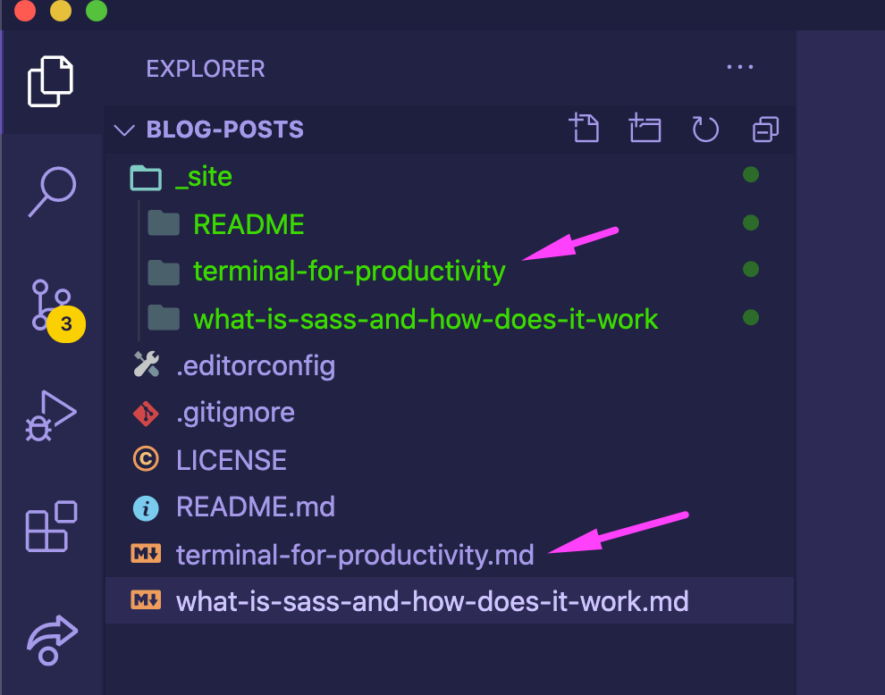

# JavaScript 2 Hackathon

> As a developer it is important to have side projects.

Note:
This hackathon is tied to your Design systems MA 3 delivery.

- it's a good way to implement the technologies you are interested in
- it shows the world you are capable developer and are actively developing code
- it shows you have willingness to learn new things
- it helps you learn

For this hackathon you are to build a Personal website with a blog section.

It is time for you start writing about what you have learned about. Do not wait for one day to come. Start now. e.g write blog post about what an Array is and how you access an index of an array. This will help you communicate and improve your understanding of JS, CSS and HTML and design.

This project will be long living, and it is to be updated during the rest of your front end course.

## Requirements

- choose a static site generator to build from
- https://www.11ty.dev/ for vanilla js
  - use es modules, everything we learned in JS 2.
- https://nextjs.org/ for React
- https://nuxtjs.org/ for VueJS
- or choose from list: [https://scotch.io/tutorials/top-10-static-site-generators-in-2020](https://scotch.io/tutorials/top-10-static-site-generators-in-2020)
- you will need to update the website design using your design system made in Design 2. (\*MA 3)
- if you do not have a design system, use your own imagination.

Must have (in order of requirement):

- a blog article page
- a homepage (Must have, keep it simple, can show list of blogs in grid or something.)
- a blog list page (list of blog posts you will write),
- about page (connect to Github API and show list of your repositories, nice to have)
- portfolio section (Nice to have, links and screenshots to your projects, leave for last)
- contact page (Nice to have, leave for last)

> This project will be long living you do not have to complete it all in one day.

### CSS Frameworks

> if you choose to use a framework you MUST OVERRIDE the styles with your DESIGN SYSTEM styles.

- use a CSS Framework ([Foundation](https://get.foundation/), [Bulma](https://bulma.io/), [Bootstrap](https://getbootstrap.com/), [UIkit](https://getuikit.com/), [Semantic UI](https://semantic-ui.com/), [Pure CSS](https://purecss.io/), [Milligram](https://milligram.io/))
- you are free to choose between Sass, CSS Modules, Styled Components, (or what ever your CSS Framework dictates)

### Level 1

- Design systems must be implemented on the UI.
- At least one blog post page visible:
  - you should be able to generate HTML pages or views from your markdown files in your blog e.g. https://github.com/mannuelf/blog-posts
  - 
  - the static site generator will take care of it for you.

### Level 2

- Design systems 2
  - Create a dark mode theme.

---

## Start project

Before starting project, please run:

### `npm install`

### `npm i --save-dev gray-matter react-markdown`

## Available Scripts

In the project directory, you can run:

### `npm run dev`

Starts Next.js in development mode.\
Open [http://localhost:3000](http://localhost:3000) to view it in the browser.

### `npm run build`

Builds the application for production usage

### `npm run start`

Starts a Next.js production server

## Resources

- The blog section was created using [this tutorial](https://jfelix.info/blog/how-to-make-a-static-blog-with-next-js)
